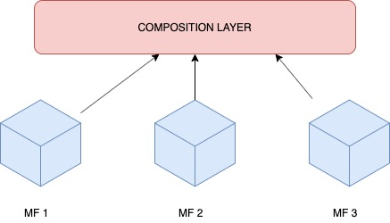

# COMPOSITION LAYER (CL)
This is the mother application, the shell, where all the other micro frontends will finally be placed.

## Scripts:

## Run for production:
`npm run serve:prod`

## Run for production in mock mode:
`npm run serve:prod:mock`

## Run standalone:
`ng serve`

## Run standalone in mock mode:
`npm run serve:mock`
