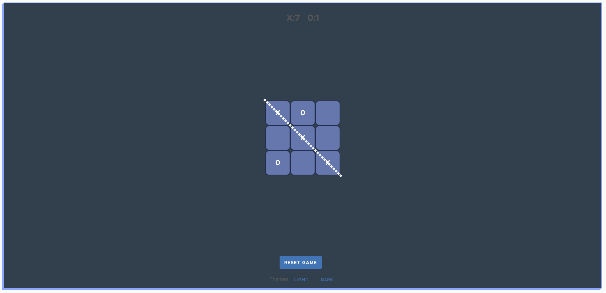

# Tic-tac-toe Micro Frontend

Purpose: Tic-tac-toe game

## TODO

##### 1) Save the score in local storage

Hint:  
Look up ngxs in order to save the state to localstorage.  
[NGXS Storage plugin](https://www.ngxs.io/plugins/storage) 
Also, the emitter plugin will come in handy  
[NGXS Emitter plugin](https://www.npmjs.com/package/@ngxs-labs/emitter)

##### 2) Create a button that will reset the score from local storage to 0

##### 3) Make the dark theme button work and make the app look like this

